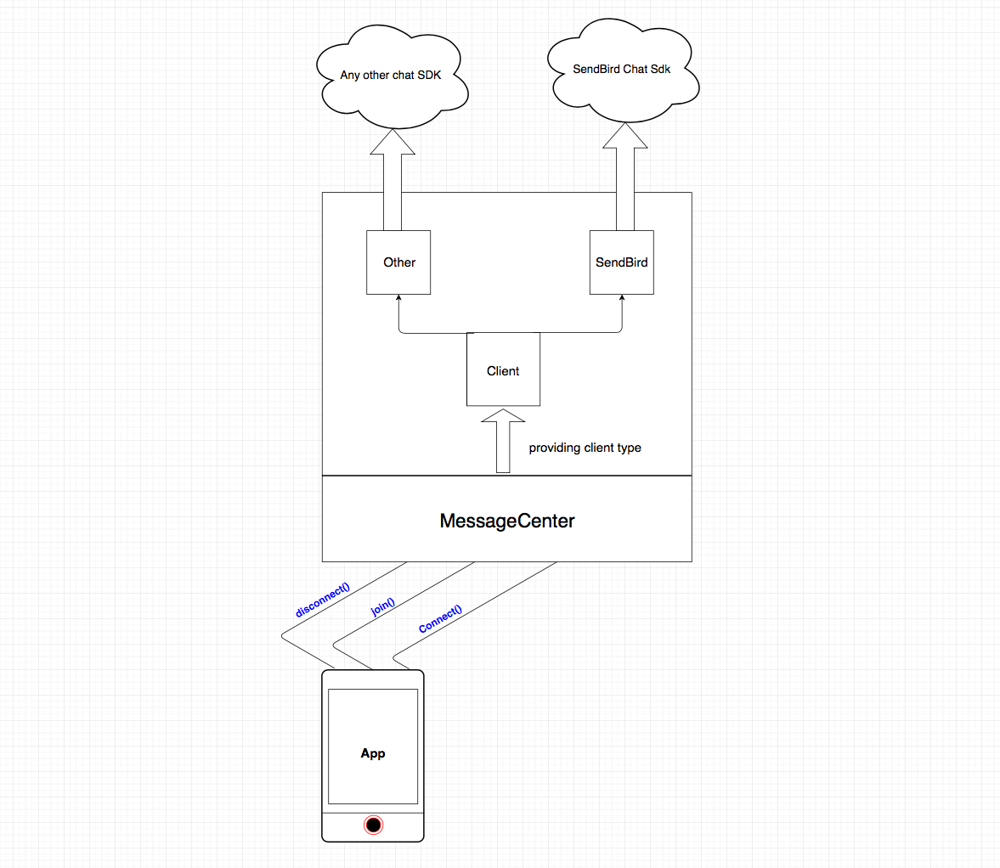

# IOS-Message-Center
###ios messaging library 

### 1. Structure



### 2. Setup
* Install MessageCenter Pod Library

```ruby
pod 'MessageCenter' , '~> pod_latest_version'
```

### 3. Sample App

* For Debugging/Testing the library (to be able to run the library as an application) do the following

* After cloning the library, cd Example and run  ```pod install ```

* Sample code will be ready to run in /ios-message-center/Example with class ViewController.swift

### 4. Usage

#### 4.1 connect()

* First Step for integrating the app is to connect on the start of the application  

```swift
MessageCenter.connect(with connectionRequest: ConnectionRequest, pushToken: Data?, success:  @escaping ConnectionSucceeded, failure:  @escaping MessageCenterFailureCompletion)
```

* Connection Request Object Has the following items 

*    var app_id; //The Application ID (provided from back-end)
*    var user_id; // User id (provided from back-end)
*    var access_token; //Access Token for Security (provided from back-end)
*    var client: ClientType; //Message Center is a Client Base Service, The only Client for now is   `MessageCenter.CLIENT_SENDBIRD`

* Connection Request Constructors 
- public init(appId: String, userId: String, accessToken: String, client: ClientType)

* Sample Code for connecting to Message Center    

```swift
MessageCenter.connect(connectRequest, pushToken:"xxxxxxxxxxx".data(using: .utf8), success: { (userId) in
//Connection Success Handlers
}) { (errorCode, message) in
//Connection Failure Handlers
}
```

#### 4.2 getUnReadMessagesCount()
* Getting Total of Unread Messages 

```swift
MessageCenter.getUnReadMessagesCount(forChannel channel: String?, success: @escaping UnReadMessagesSuccessCompletion, failure: @escaping MessageCenterFailureCompletion)
```
* if chat_id is not provided, the sdk will retrieve the total unread messages for all channels 
* if chat_id is provided, the sdk will retrieve the total unread messages for the provided channel
* Sample code for retrieving the count 
```swift
MessageCenter.getUnReadMessagesCount(forChannel: "test_channel", success: { (count) in
//Handle Success
}) { (code, message) in
// Handle Failure
}
```

#### 4.3 openChatView()
* Joining the chat by url(id) provided
* Sample code for joining a conversation
```swift
MessageCenter.openChatView("sendbird_group_channel_2456028_1ef918c0149a1f8b0993ae21cb26fa9c16540a91", theme: theme) { (success) in
if success == true {

}
else {

}
} 
```
* if Theme object is not provided, the app will take the defaults 
* Theme Object for IOS have (```toolbar```, ```toolbar_subtitle```, ```welcome_message```) ..
* `enableCalling` flag indicates whether to show or hide the call icon.. in case of `true` use `MessageCenterDelegate` to handle call tap action.
* Executing this call will open the chatting window 
* an error callback will be triggered in case of error where success will be false

#### 4.4 closeChatView()
* Closing the chat view from the app side
* Sample code for closing the chat view
```swift
MessageCenter.closeChatView(completion: @escaping () -> Void)
```
* Executing this interface will close the chatting window in the sdk

#### 4.5 appHandleNotification()

* checks payload if its related to MessageCenter Notifications 

* Sample code for Handling App MessageCenter Notification 
```swift
MessageCenter.handleMessageNotification([AnyHashable : Any]) -> Bool //Indecating if notification Matched with SDK
```

#### 4.6 isConnected()

* returns true if Message Center is connected 

* Sample code for checking connection
```swift
MessageCenter.isConnected -> Bool 
```

#### 4.7 disconnect()

* Disconnects the chat services and stop receiving notifications for chat, best case to use if with user logout 

* Sample code for disconnecting
```swift
MessageCenter.disconnect(completion: @escaping () -> Void)
```
### MessageCenterDelegate:
* This delegate has two main funcs:
```swift
func userDidTapCall(forChannel channel: String, success: @escaping (_ phoneNumber: String) -> Void, failure: @escaping (_ errorMessage: String) -> Void)
```

Will be called if the enableCalling was passed as true, and the call icon was tapped.


```swift
func eventDidOccur(forChannel channel: String, event: MessageCenterEvents, userInfo: [AnyHashable: Any])
```

Called when an event happen in the SDK; events are manually triggered.

